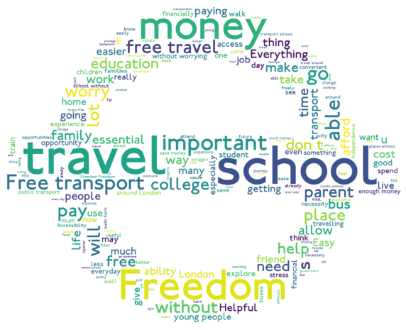

# London Free Transport

## Project Overview 

Imbalanced classification project using data which explores the views of young Londoners (aged 16-18) regarding the decision to suspend free travel for under-18s.

[**Click here to view the notebook in nbviewer**](https://nbviewer.jupyter.org/github/dan-grant-hunter/London_Free_Transport/blob/main/london_free_transport.ipynb)

## Summary of Findings

**Below are some of the key findings from the analysis:**

- An overwhelming majority of young Londoners (>95%) disapproved of the plans to end free transport while a small percentage either approved of the plans (\~2%) or were unsure (\~2%).

- Males were more than twice as likely to approve of the decision to end free transport than females (1.62% vs 0.69% of total number of participants respectively).

- Females were significantly more concerned than males about safety in London if they lost free transport.

- Over 95% of young Londoners consider free transport either important or very important.

- Travel, freedom, school and money were some of the most common words used when participants were asked to describe what free travel meant to them.

- Nearly three quarters of participants take two or more forms of transport to get to school/college.

- Ending free transport would change how almost three quarters of young Londoners get to school/college. 

## Statistical Summary of Models

## Code and Resources Used 
**Python Version:** 3.8.5  
**Packages:** pandas, numpy, matplotlib, seaborn, scikit-learn, wordcloud, PIL, imblearn, xgboost 

## About the Data

Following proposals to end free transport for young people in London, a survey was conducted to understand how this may impact them and their future decisions.

Over 2000 young Londoners, aged 16 to 18, participated in the survey in which data was collected over the course of five consecutive days in 2020. 

The data includes general demographic data as well as more specific data such as transport methods to school/college, mental health, safety, impact on recreational activities and whether young Londoners approve or disapprove of the decision to end free transport.

*For access to the source data, please visit - https://data.london.gov.uk/dataset/free-travel-means-everything-to-me*

## EDA

Below are a few highlights from the analysis. 

  

**Question: Do you approve or disapprove the decision to cut free travel for under-18s in London?**

  

**Impact of cutting free travel on different activities:**

 
